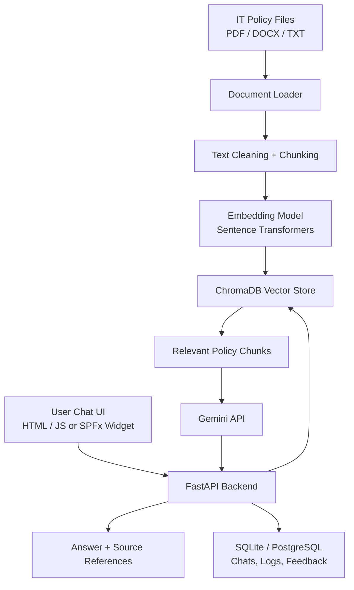

# Chatbot Architecture

## Goal

Build a secure internal IT policy chatbot in two stages:

1. Standalone local web chatbot for testing and document QA
2. SharePoint One Desk integration as a bottom-right floating chat widget

## High-level architecture



## Main components

### 1. Chat UI

Initial version:

- HTML
- CSS
- JavaScript

Future SharePoint version:

- SPFx Application Customizer
- floating launcher icon
- popup panel attached to the current SharePoint page

Responsibility:

- accept user questions
- show answers and source references
- show fallback response when information is not found in policies

### 2. FastAPI backend

Responsibility:

- receive chat messages
- search relevant policy chunks
- call Gemini with only the retrieved context
- return structured answer plus citations
- manage uploads, reindexing, logs, and admin actions

Recommended endpoints:

- `GET /api/health`
- `POST /api/chat`
- `GET /api/policies`
- `POST /api/policies/reindex`
- `POST /api/policies/upload`
- `DELETE /api/policies/{policy_id}`

### 3. Document processing layer

Responsibility:

- read policy files from upload folder
- extract text from PDF, DOCX, and TXT
- clean and normalize text
- split text into smaller chunks
- attach metadata like policy name, page number, and section

Suggested libraries:

- PyMuPDF
- `python-docx`

### 4. Embedding layer

Responsibility:

- convert each chunk into a searchable vector
- convert each user question into a vector for retrieval

Recommended starter model:

- `sentence-transformers/all-MiniLM-L6-v2`

Why this is good first:

- no embedding API cost for the first version
- easy local testing
- fast enough for internal policy retrieval

### 5. Vector database

Responsibility:

- store chunk embeddings
- return the most relevant policy chunks for a user question

Recommended first choice:

- ChromaDB

Stored metadata should include:

- document name
- page number
- section heading
- upload date
- chunk text

### 6. Gemini answer generation

Responsibility:

- generate the final natural-language answer
- stay inside the retrieved policy context
- refuse to invent answers outside available policies

Prompting rules:

- answer only from provided policy chunks
- cite policy name and section when available
- if the answer is missing, respond with: `Information not available in IT policies.`

### 7. Application database

First version:

- SQLite

Production:

- PostgreSQL or SQL Server

Stores:

- chat sessions
- chat messages
- policy document metadata
- user feedback
- audit logs
- unanswered question logs

## Request flow

### Policy indexing flow

```text
Policy upload
  -> text extraction
  -> text cleaning
  -> chunking
  -> embeddings
  -> ChromaDB
```

### User chat flow

```text
User question
  -> FastAPI backend
  -> embedding of question
  -> ChromaDB similarity search
  -> top policy chunks
  -> Gemini answer generation
  -> answer + source references
```

## Security model

### Correct secure flow

```text
SharePoint or local chat UI
  -> FastAPI backend
  -> Gemini API
```

### What should not happen

```text
Frontend
  -> direct Gemini API call
```

### Key security rules

- keep `GEMINI_API_KEY` only in backend `.env`
- enable HTTPS in production
- restrict CORS to known frontend origins
- add rate limiting on chat routes
- validate uploads and file types
- keep audit logs for admin and policy actions
- review Gemini data-handling terms before using confidential internal policies in production

## Authentication and authorization

Standalone local version:

- simple local admin access or no auth during early development

SharePoint version:

- SharePoint logged-in identity
- Microsoft Entra ID
- role-based access

Suggested roles:

- Employee: ask questions only
- IT Admin: upload, delete, reindex policies
- System Admin: configure system settings and audit access

## Deployment path

Development:

- Windows machine
- local FastAPI server
- local frontend

Production options:

- internal Windows Server with IIS reverse proxy
- Linux server with Nginx
- Azure App Service
- Dockerized deployment

## Recommended phase plan

### Phase 1

- FastAPI setup
- Gemini connection test
- simple chat UI
- sample response flow

### Phase 2

- PDF, DOCX, TXT ingestion
- chunking and embeddings
- ChromaDB retrieval
- source references
- fallback handling

### Phase 3

- admin upload panel
- policy delete and reindex
- chat history and feedback
- unanswered question review

### Phase 4

- SPFx Application Customizer
- floating SharePoint widget
- SharePoint SSO
- production deployment hardening

## What will be used in this architecture

If someone asks, "is project mein kya kya use hoga?", the short answer is:

- FastAPI backend
- Gemini API for final answer generation
- sentence-transformers for embeddings
- ChromaDB for policy search
- PyMuPDF and `python-docx` for document reading
- SQLite first, PostgreSQL later
- HTML/CSS/JavaScript for local UI
- SPFx for final SharePoint integration
